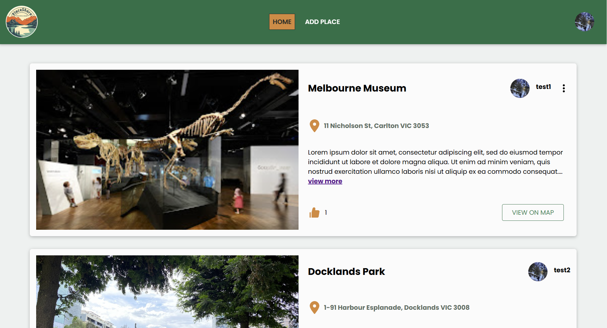
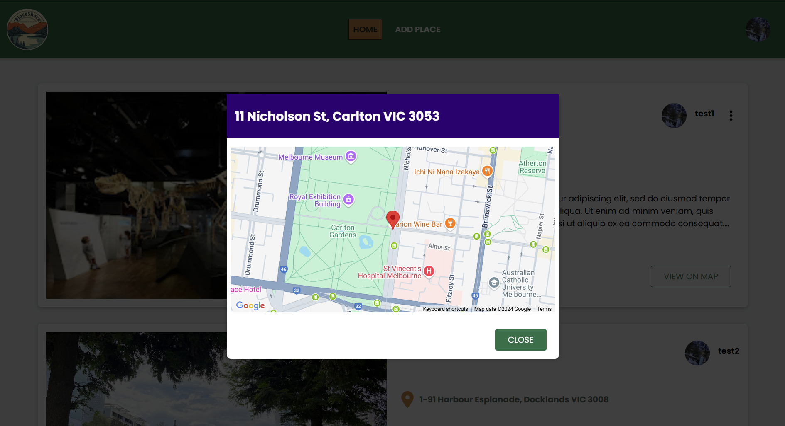
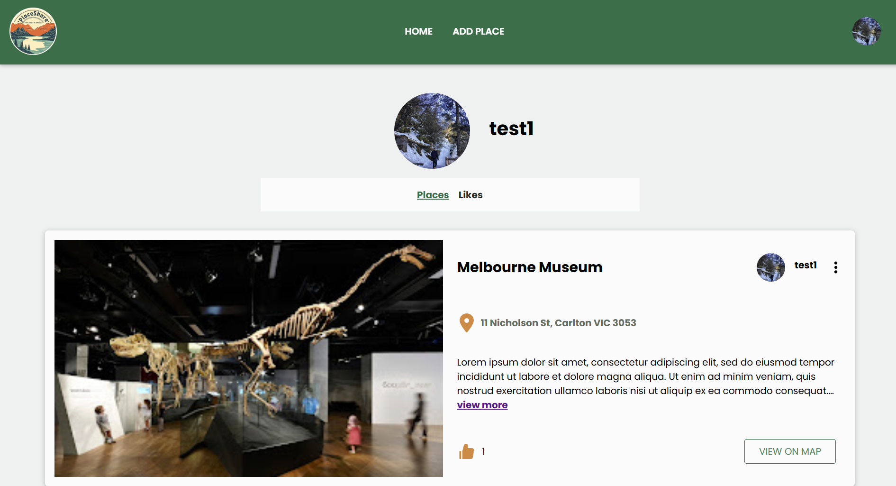
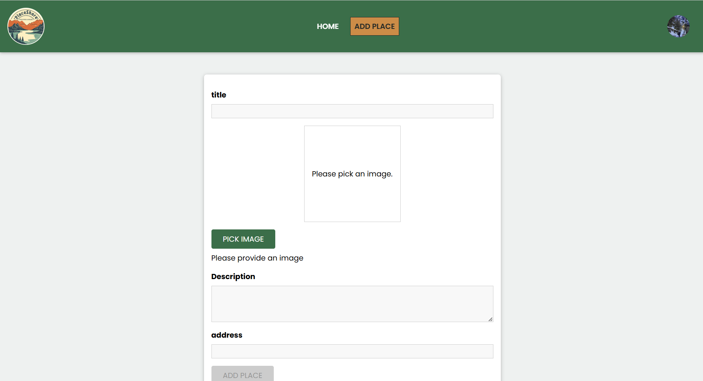
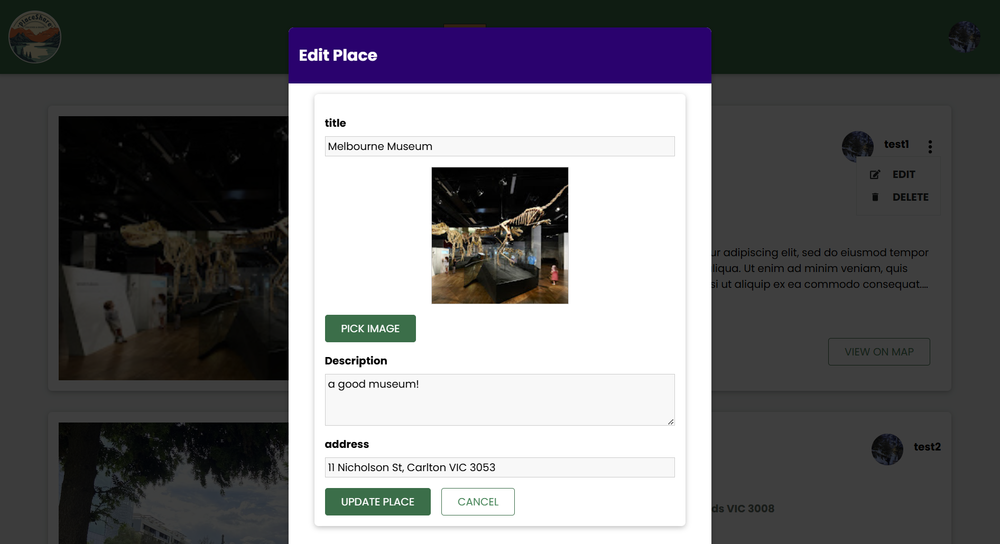
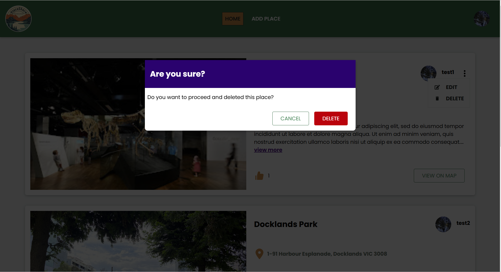

# PlaceShare MERN Application Frontend
PlaceShare is a MERN stack application for sharing places, featuring user authentication, user profiles, place display and upload, place liking, and location viewing via Google Maps API.   
The full application contains both a frontend and a backend:
- The frontend (**this repository**) is developed using React.js.
- The backend is implemented with Express.js, Node.js, and MongoDB, featuring RESTful API endpoints, JWT-based authentication, MongoDB with Mongoose, and Cloudinary for image uploads.  
For backend details, visit the [Backend Repository](https://github.com/Weiran-Zou/mern-places-sharing-backend)

## Screenshots
.
.
.
.
.
.

## Introduction
The frontend of the PlaceShare MERN app is built with React.js, providing a seamless and intuitive user experience.  
It includes the following key features:
- Sign In and Sign Up pages with form validation and error handling
- A Home Page displaying places of all users, along with a Place Details Page and a User Profile Page 
- Functionality for users to upload, edit and delete a place 
- Integration with Google Maps for viewing locations of places on a map
- A feature enabling logged-in users to like places and view their liked places on User Profile Page

## Technologies used
- React.js
- JavaScript
- Google Maps API

## Installation
To run this project, please follow the steps below

- git clone the project
- change directory: cd mern-places-sharing-frontend
- install dependencies: npm install
- run commend: npm start
